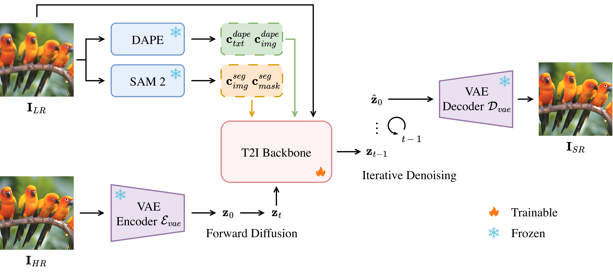

# SegESR: Segmentation Enhanced Super-Resolution

> **SegESR** is an advanced image super-resolution diffusion framework that leverages the power of a foundational segmentation model. Building upon the foundation of [SeeSR](https://github.com/cswry/SeeSR), this project introduces novel architectural improvements and optimization strategies to enhance generation quality and efficiency.

---

## 📄 Abstract
> Diffusion-based Image Super-Resolution (ISR) models achieve remarkable perceptual quality but often suffer from structural hallucinations. Specifically, existing semantic-aware methods rely on high-level tags or text prompts that inherently lack fine-grained geometric information. In this work, we propose *Segmentation Enhanced Super-Resolution* (SegESR), a novel framework leveraging the hierarchical layout-preserving features of a foundational segmentation model, alongside text, to construct a robust structural scaffold for the restoration process. To effectively integrate these priors, we introduce the *Parallel Attention Fusion Block* (PAFB). This module disentangles semantic and spatial conditions, injecting them via a parallel stream architecture. Furthermore, we design a perceptual loss optimized directly within the pre-trained segmentation feature space. Extensive experiments demonstrate that SegESR effectively mitigates hallucinations, achieving state-of-the-art synthetic fidelity (+2.22 dB PSNR, +0.06 SSIM) and competitive real-world perceptual quality (+0.008 CLIPIQA).

---

## 🧩 Architecture Overview


## 🔎 Key Innovations

Unlike traditional super-resolution methods, SegESR integrates segmentation-aware priors to guide the diffusion process. Key contributions include:

* **SAM 2-Guided Generation**: Introduced two new semantic priors derived from SAM 2:
    * **SICA (SAM Image Cross-Attention)**: Leverages SAM 2 image embeddings from the [Hiera Encoder](https://huggingface.co/docs/transformers/model_doc/hiera).
    * **SMCA (SAM Masks Cross-Attention)**: Utilizes SAM 2 segmentation embeddings to preserve object boundaries and details.
* **Parallelized PAFB Architecture**: Introduced the *Parallel Attention Fusion Block (PAFB)*. Text, image embeddings and segmentation embeddings are now processed in **parallel** and fused via a trainable convolutional layer, streamlining the information flow compared to sequential approaches.
* **SAM 2 Perceptual Loss**: Integrated a new perceptual loss function based on the SAM 2 feature space, supplementing the standard MSE diffusion loss to improve semantic consistency in the super-resolved output.
* **Memory Optimization**: The architecture is optimized for consumer-grade hardware (e.g., NVIDIA RTX 4090), significantly reducing VRAM usage without compromising performance.

## 🛠️ Installation

The environment can be set up using standard Python package management.

1.  **Clone the repository**
    
2.  **Create an environment**
      ```bash
      conda create -n segesr python=3.8
      conda activate segesr
      ```
    
3.  **Install dependencies**
    ```bash
    pip install -r requirements.txt
    ```

    *Note: If you are using xformers for memory efficiency, ensure it is compatible with your PyTorch/CUDA version.*

## 🚀 Inference
#### Download the pretrained models
- Download the pretrained SD-2-base model.
- Download the SeeSR, DAPE, RAM, Tiny VAE and SAM 2 models.
- Download the test datasets (DIV2K-Val, RealLR200, RealSR and DRealSR).

You can put the models into `preset/models`, the test datasets into `preset/datasets/test_datasets` and then run:

```bash
./scripts/test.sh
```

## 🌈 Train 
#### Step 1: Prepare training data
Pre-prepare training data pairs for the training process, which would take up some memory space but save training time. SegESR was trained with 15% of [LSDIR](https://huggingface.co/ofsoundof/LSDIR) randomly sampled using the `scripts/make_train_subset.sh` script + the first 5K images of [FFHQ](https://huggingface.co/datasets/marcosv/ffhq-dataset). Put the images of LSDIR into `preset/datasets/train_datasets/LSDIR/full_dataset`, execute the script and the add the images from FFHQ into `preset/datasets/train_datasets/LSDIR/finetune_subset`.

For making paired data when training SegESR, you can run:

```bash
python -W ignore utils_data/make_paired_data.py \
--gt_path preset/datasets/train_datasets/LSDIR/finetune_subset \
--save_dir preset/datasets/train_datasets/LSDIR \
--epoch 1
```

- `--gt_path` the path of gt images. If you have multi gt dirs, you can set it as `PATH1 PATH2 PATH3 ...`
- `--save_dir` the path of paired images 
- `--epoch` the number of epoch you want to make

The difference between `make_paired_data_DAPE.py` and `make_paired_data.py` lies in that `make_paired_data_DAPE.py` resizes the entire image to a resolution of 512, while `make_paired_data.py` randomly crops a sub-image with a resolution of 512.

Include the SAM 2 repository into your own. Then, for making the data, you can run:

```bash
./scripts/make_seg.sh
```

Once the degraded data pairs and SAM 2 data are created, generate tag data by running `utils_data/make_tags.py`.

The data folder should be like this:

```
your_training_datasets/
    └── gt
        └── 0000001.png # GT images, (512, 512, 3)
        └── ...
    └── lr
        └── 0000001.png # LR images, (512, 512, 3)
        └── ...
    └── tag
        └── 0000001.txt # tag prompts
        └── ...
```


#### Step 2: Training SegESR

```bash
./scripts/train.sh
```

## 📜 Credits & Acknowledgments
This project is built upon the excellent research of **SeeSR** and **SAM 2**.

* **Original Codebase**: [SeeSR (CVPR 2024)](https://github.com/cswry/SeeSR).
* **Segment Anything Model 2**: [Meta AI SAM 2](https://github.com/facebookresearch/sam2).

If you find this code useful, please consider citing the original works:
The following are BibTeX references:

```
@inproceedings{wu2024seesr,
  title={Seesr: Towards semantics-aware real-world image super-resolution},
  author={Wu, Rongyuan and Yang, Tao and Sun, Lingchen and Zhang, Zhengqiang and Li, Shuai and Zhang, Lei},
  booktitle={Proceedings of the IEEE/CVF conference on computer vision and pattern recognition},
  pages={25456--25467},
  year={2024}
}
```
```
@article{ravi2024sam,
  title={Sam 2: Segment anything in images and videos},
  author={Ravi, Nikhila and Gabeur, Valentin and Hu, Yuan-Ting and Hu, Ronghang and Ryali, Chaitanya and Ma, Tengyu and Khedr, Haitham and R{\"a}dle, Roman and Rolland, Chloe and Gustafson, Laura and others},
  journal={arXiv preprint arXiv:2408.00714},
  year={2024}
}
```

## 👨‍💻 Maintainers
* **Anonymous Authors**

## 🎫 License
This project and related weights are released under the [Apache 2.0 license](LICENSE).