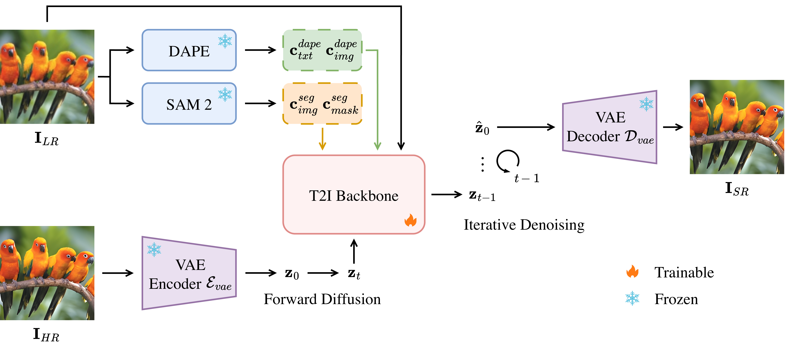

# SegESR: Segmentation Enhanced Super-Resolution

> **SegESR** is an advanced image super-resolution diffusion framework that leverages the power of a foundational segmentation model. Building upon the foundation of [SeeSR](https://github.com/cswry/SeeSR), this project introduces novel architectural improvements and optimization strategies to enhance generation quality and efficiency.

---

## 📄 Abstract
> Diffusion-based Image Super-Resolution (ISR) models achieve remarkable perceptual quality but often suffer from structural hallucinations. Specifically, existing semantic-aware methods rely on high-level tags or text prompts that inherently lack fine-grained geometric information. In this work, we propose *Segmentation Enhanced Super-Resolution* (SegESR), a novel framework leveraging the hierarchical layout-preserving features of a foundational segmentation model, alongside text, to construct a robust structural scaffold for the restoration process. To effectively integrate these priors, we introduce the *Parallel Attention Fusion Block* (PAFB). This module disentangles semantic and spatial conditions, injecting them via a parallel stream architecture. Furthermore, we design a perceptual loss optimized directly within the pre-trained segmentation feature space. Extensive experiments demonstrate that SegESR effectively mitigates hallucinations, achieving state-of-the-art synthetic fidelity (+2.22 dB PSNR, +0.06 SSIM) and competitive real-world perceptual quality (+0.008 CLIPIQA).

---

## 🧩 Architecture Overview


## 🔎 Key Innovations

Unlike traditional super-resolution methods, SegESR integrates segmentation-aware priors to guide the diffusion process. Key contributions include:

* **SAM 2-Guided Generation**: Introduced two new semantic priors derived from SAM 2:
    * **SICA (SAM Image Cross-Attention)**: Leverages SAM 2 image embeddings from the [Hiera Encoder](https://huggingface.co/docs/transformers/model_doc/hiera).
    * **SMCA (SAM Masks Cross-Attention)**: Every SAM 2 segment becomes one token (the Hiera embedding averaged inside its mask), so the condition does not depend on the order or the number of masks. Each latent pixel attends only to the segments covering it (*segment routing*), which preserves object boundaries and details.
* **Closed-loop SAM 2 conditions**: At inference, the SAM 2 conditions are recomputed on the predicted clean image at a few timesteps (`sam_refresh_timesteps`), instead of relying only on masks extracted from the degraded LR input. During training, low-noise samples are conditioned on the SAM 2 outputs of the GT image with probability `clean_sam_prob · (1 - t/T)` to match it.
* **Parallelized PAFB Architecture**: Introduced the *Parallel Attention Fusion Block (PAFB)*. Text, image embeddings and segmentation embeddings are now processed in **parallel** and fused via a trainable convolutional layer, streamlining the information flow compared to sequential approaches.
* **SAM 2 Perceptual Loss**: Integrated a new perceptual loss function based on the SAM 2 feature space, supplementing the standard MSE diffusion loss to improve semantic consistency in the super-resolved output.
* **Memory Optimization**: The architecture is optimized for consumer-grade hardware (e.g., NVIDIA RTX 4090), significantly reducing VRAM usage without compromising performance.

## 🛠️ Installation

The environment can be set up using standard Python package management.

1.  **Clone the repository**
    
2.  **Create an environment**
      ```bash
      conda create -n segesr python=3.10
      conda activate segesr
      ```
    
3.  **Install dependencies**
    ```bash
    pip install -r requirements.txt
    pip install git+https://github.com/facebookresearch/sam2.git   # SAM 2.1
    pip install -e .                                               # segesr + vendored ram / basicsr
    ```

    *Note: If you are using xformers for memory efficiency, ensure it is compatible with your PyTorch/CUDA version.*

    The scripts also work without `pip install -e .` when launched from the repository root.

4.  **Run the tests** (optional)
    ```bash
    pytest
    ```

## 🚀 Inference
#### Download the pretrained models
- Download the pretrained SD-2-base model.
- Download the SeeSR, DAPE, RAM, Tiny VAE and SAM 2 models.
- Download the test datasets (DIV2K-Val, RealLR200, RealSR and DRealSR).

You can put the models into `preset/models`, the test datasets into `preset/datasets/test_datasets` and then run:

```bash
./scripts/run_test.sh preset/train_output/segesr          # every checkpoint-* of a run, all test datasets + metrics
```

or, for a single checkpoint and folder of LR images:

```bash
python test.py --config configs/test_default.yaml \
--finetuned_model_path preset/train_output/segesr/checkpoint-XXXX \
--image_path preset/datasets/test_datasets/RealSR/test_LR \
--output_dir preset/datasets/output/RealSR
```

SAM 2.1 weights are downloaded from the Hugging Face Hub (`facebook/sam2.1-hiera-large`) on first use.

`segment_routing` must match the training config. `sam_refresh_timesteps` (default `[750, 500, 250]`) sets when the SAM 2 conditions are recomputed on the predicted clean image; each refresh decodes the current estimate and runs SAM 2 once, and `--sam_refresh_timesteps` with no value disables it.

## 🌈 Train 
#### Step 1: Prepare training data
Pre-prepare training data pairs for the training process, which would take up some memory space but save training time. SegESR is trained with 15% of [LSDIR](https://huggingface.co/ofsoundof/LSDIR) randomly sampled + the first 1.5K images of [FFHQ](https://huggingface.co/datasets/marcosv/ffhq-dataset), which keeps the share of face images of SeeSR (LSDIR + 10K FFHQ). Put the sampled LSDIR images and the FFHQ images into `preset/datasets/train_datasets/LSDIR/finetune_subset`.

The whole pipeline (degraded pairs, RAM tags, DAPE embeddings, SAM 2 embeddings and mask logits of the LR and GT images) can be run with:

```bash
./scripts/prepare_data.sh preset/datasets/train_datasets/LSDIR/finetune_subset preset/datasets/train_datasets/LSDIR
```

or step by step with the scripts in `data_tools/`:

```bash
python data_tools/make_paired_data.py --gt_path preset/datasets/train_datasets/LSDIR/finetune_subset --save_dir preset/datasets/train_datasets/LSDIR --epoch 1
python data_tools/make_tags.py --root_path preset/datasets/train_datasets/LSDIR
python data_tools/make_dape_embeds.py --image_dir preset/datasets/train_datasets/LSDIR/sr_bicubic --embed_dir preset/datasets/train_datasets/LSDIR/dape_embeds --ram_ft_path preset/models/DAPE.pth
python data_tools/sam_processing.py --image_dir preset/datasets/train_datasets/LSDIR/sr_bicubic --embed_dir preset/datasets/train_datasets/LSDIR/sam_embeds --logit_dir preset/datasets/train_datasets/LSDIR/seg_embeds
python data_tools/sam_processing.py --image_dir preset/datasets/train_datasets/LSDIR/gt --embed_dir preset/datasets/train_datasets/LSDIR/sam_embeds_gt --logit_dir preset/datasets/train_datasets/LSDIR/seg_embeds_gt
```

The last step (SAM 2 on the GT images) is only needed by `clean_sam_prob > 0`; skip it in `prepare_data.sh` with `WITH_GT_SAM=false`.

- `--gt_path` the path of gt images. If you have multi gt dirs, you can set it as `PATH1 PATH2 PATH3 ...`
- `--save_dir` the path of paired images 
- `--epoch` the number of epoch you want to make

`make_paired_data.py` randomly crops a sub-image with a resolution of 512.

The data folder should be like this (files are matched by name):

```
your_training_datasets/
    └── gt
        └── 0000001.png # GT images, (512, 512, 3)
    └── sr_bicubic
        └── 0000001.png # bicubic-upsampled LR images, (512, 512, 3)
    └── lr
        └── 0000001.png # LR images, (128, 128, 3)
    └── tag
        └── 0000001.txt # tag prompts
    └── dape_embeds
        └── 0000001.pt  # DAPE image embeddings
    └── sam_embeds
        └── 0000001.pt  # SAM 2 image embeddings, (1, 256, 64, 64)
    └── seg_embeds
        └── 0000001.pt  # SAM 2 mask decoder logits, (N, 1, 256, 256)
    └── sam_embeds_gt   # (optional, for clean_sam_prob) as sam_embeds, on the GT image
    └── seg_embeds_gt   # (optional, for clean_sam_prob) as seg_embeds, on the GT image
```


#### Step 2: Training SegESR

```bash
./scripts/run_train.sh configs/train_default.yaml
```

Every key of the YAML config is a `train.py` argument, and flags passed on the command line override the config (e.g. `./scripts/run_train.sh configs/train_default.yaml --max_train_steps=1000`). `configs/train_sam_ablation.yaml` trains the same model without the SAM 2 perceptual loss.

## 🖥️ SLURM cluster

`cluster/` contains SLURM jobs that run everything inside the `pytorch/pytorch:2.6.0-cuda12.6-cudnn9-devel` Singularity container, with a virtual environment in `~/venvs/segesr` (`requirements-cluster.txt`). Submit them from the repository root; logs go to `slurm_logs/`.

```bash
sbatch cluster/setup_env.sh                                   # once: container, packages, SAM 2.1 weights, tests
sbatch cluster/download_models.sh                             # once: SD 2 base, SeeSR + DAPE, RAM, tiny VAE
sbatch cluster/download_datasets.sh                           # once: test sets, LSDIR + FFHQ training subset
sbatch cluster/prepare_data.sh preset/datasets/train_datasets/LSDIR/finetune_subset preset/datasets/train_datasets/LSDIR
sbatch cluster/train.sh configs/train_default.yaml --output_dir=preset/train_output/segesr_v2
sbatch cluster/test.sh preset/train_output/segesr_v2
```

Edit the `#SBATCH` lines (partition, QOS, memory) for another cluster.

`data_tools/download_data.py` (run by `cluster/download_models.sh` and `cluster/download_datasets.sh`, or directly) downloads everything into `preset/` except RealLR200, which is only on [Google Drive](https://drive.google.com/drive/folders/1L2VsQYQRKhWJxe6yWZU9FgBWSgBCk6mz). LSDIR is gated: accept its terms at [huggingface.co/ofsoundof/LSDIR](https://huggingface.co/ofsoundof/LSDIR) and save a read token in `~/.cache/huggingface/token` first. The full LSDIR (~155 GB) is kept in `preset/datasets/LSDIR_full` unless `--delete_full_lsdir` is passed.

## 📜 Credits & Acknowledgments
This project is built upon the excellent research of **SeeSR** and **SAM 2**.

* **Original Codebase**: [SeeSR (CVPR 2024)](https://github.com/cswry/SeeSR).
* **Segment Anything Model 2**: [Meta AI SAM 2](https://github.com/facebookresearch/sam2).

If you find this code useful, please consider citing the original works:
The following are BibTeX references:

```
@inproceedings{wu2024seesr,
  title={Seesr: Towards semantics-aware real-world image super-resolution},
  author={Wu, Rongyuan and Yang, Tao and Sun, Lingchen and Zhang, Zhengqiang and Li, Shuai and Zhang, Lei},
  booktitle={Proceedings of the IEEE/CVF conference on computer vision and pattern recognition},
  pages={25456--25467},
  year={2024}
}
```
```
@article{ravi2024sam,
  title={Sam 2: Segment anything in images and videos},
  author={Ravi, Nikhila and Gabeur, Valentin and Hu, Yuan-Ting and Hu, Ronghang and Ryali, Chaitanya and Ma, Tengyu and Khedr, Haitham and R{\"a}dle, Roman and Rolland, Chloe and Gustafson, Laura and others},
  journal={arXiv preprint arXiv:2408.00714},
  year={2024}
}
```

## 👨‍💻 Maintainers
* **Andrea Tomasoni**

## 🎫 License
This project and related weights are released under the [Apache 2.0 license](LICENSE).
